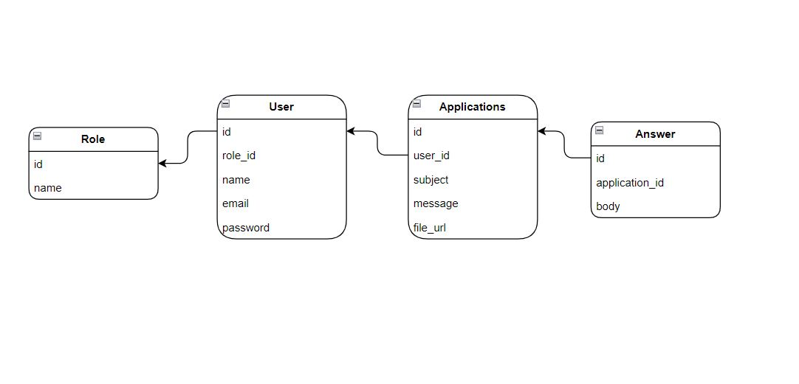

## Laravel Task

### Setup

- ``composer install``
- ``npm install``
- ``npm run dev``
- ``php artisan storage:link``
- ``php artisan queue:work``
- ``php artisan migrate --seed``
- ``php artisan queue:listen``

### Database Relationship Diagrams

### Completed tasks

- Auth - authentication
- Role 2: client, manager
- Authorization - permissions
- CRUD
- Form, file upload
- Email
- Queue, Job
